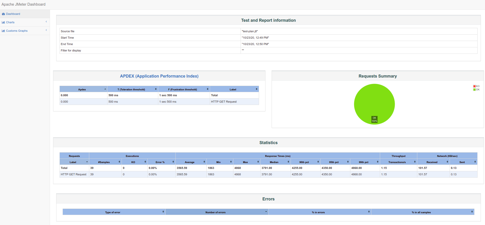

[](https://hub.docker.com/r/justb4/jmeter)

# jmeter-docker-example

This is an example for [dilshan7fdo/jmeter-docker](https://hub.docker.com/r/dilshan7fdo/jmeter-docker) image.

## Do it for real: detailed build/run/test

1. In a Terminal/Command session, install Git, navigate/make a folder, then:

   ```
   git clone https://github.com/dilshan5/jmeter-docker-client-example.git
   cd jmeter-docker-client-example
   ```

1. Run the test script:

   ```
   ./test.sh
   ```

   If you view the script, note it invokes the <strong>run.sh</strong> script file stored at the repo's root. View that file to see that it specifies docker image commands.
   
   File and folder names specified in the test.sh script reflected in the last line in the response for its run:

   <pre>
   ==== HTML Test Report ====
   See HTML test report in tests/basic/report/index.html
   </pre>

1. Switch to your machine's Folder program and navigate to the folder containing files which replaces files cloned in from GitHub:
   
   ```
   cd tests/basic
   ```
   
   The files are:
   
   * jmeter.log
   * reports folder (see below)
   * basic-test-plan.jmx containing a basic JMeter test plan.
   * test-plan.jtl containing statistics from the run displayed by the index.html file.
   
   
1. Navigate into the <strong>report</strong> folder and open the <strong>index.html</strong> file to pop up a browser window displaying the run report. On a Mac Terminal:
   
   ```
   cd report
   open index.html
   ```

   Here is a sample report:

   


## Specifications

A generic ``entrypoint.sh`` is copied into the Docker image and
will be the script that is run when the Docker container is running. The
``entrypoint.sh`` simply calls ``jmeter`` passing all arguments provided
to the Docker container, see [run.sh](run.sh) script:

```
sudo docker run --name ${NAME} -i -v ${WORK_DIR}:${WORK_DIR} -w ${WORK_DIR} ${IMAGE} $@
```

